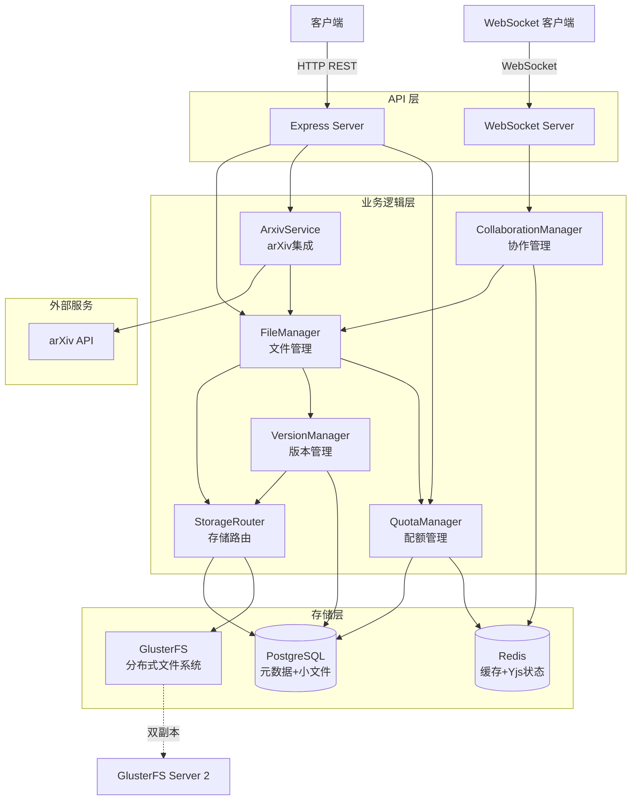
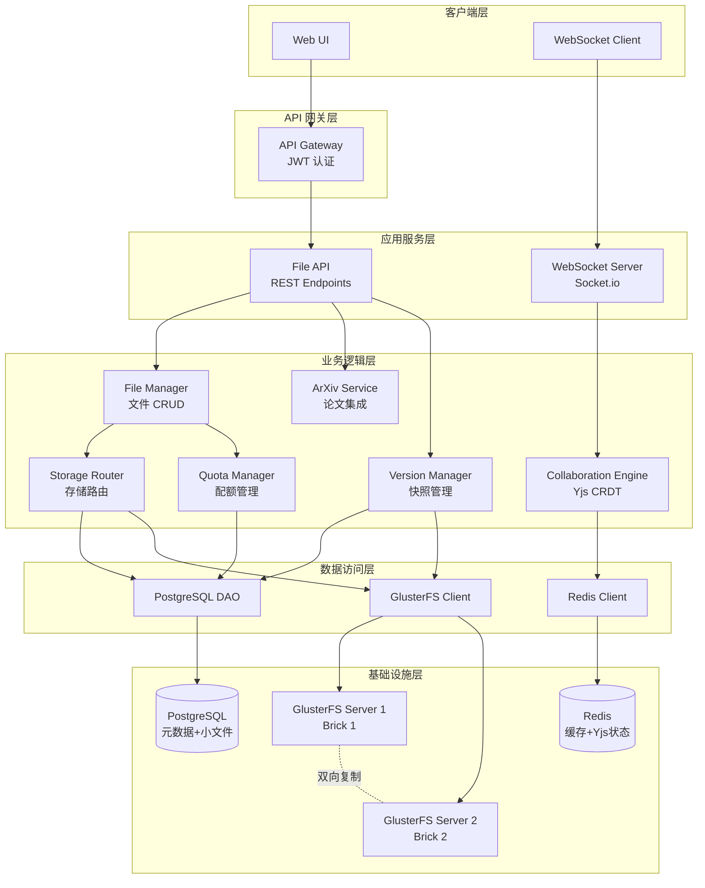

# 文件存储服务设计文档

## Overview

文件存储服务是一个支持实时协作的分布式文件管理系统，为 LaTeX 在线编辑平台提供核心存储能力。系统采用混合存储架构，结合 PostgreSQL 和 GlusterFS 的优势，同时集成 Yjs CRDT 技术实现无冲突的多人协作编辑。

### 核心特性

- **混合存储策略**：小文件（<1MB）存储在 PostgreSQL 以获得快速访问，大文件（≥1MB）存储在 GlusterFS 以保证可靠性和扩展性
- **实时协作编辑**：基于 Yjs CRDT 和 WebSocket 实现多人同时编辑，自动解决冲突
- **版本控制**：支持手动和自动快照创建，使用增量存储优化空间使用
- **arXiv 集成**：提供论文检索、下载和 BibTeX 引用生成功能
- **配额管理**：用户级（5GB）和项目级（3GB）配额限制，实时监控和告警
- **高可用性**：GlusterFS 双副本部署，目标可用性 >99.5%
- **访问控制**：基于项目的权限管理，支持所有者和协作者角色

### 技术栈

- **运行时**：Node.js 20 + Express
- **实时协作**：Yjs + y-websocket
- **分布式存储**：GlusterFS（双副本）
- **数据库**：PostgreSQL（元数据 + 小文件）
- **缓存**：Redis（元数据缓存 + Yjs 状态）
- **部署**：2 台服务器，GlusterFS 双副本配置

## Architecture

### 系统架构图



### 架构设计原则

1. **关注点分离**：各模块职责清晰，FileManager 负责文件操作，StorageRouter 负责存储决策，CollaborationManager 负责实时协作
2. **可扩展性**：GlusterFS 支持水平扩展，可根据需求增加存储节点
3. **高可用性**：双副本存储保证数据可靠性，Redis 缓存提高读取性能
4. **性能优化**：混合存储策略平衡性能和成本，小文件快速访问，大文件可靠存储

## Components and Interfaces

### FileManager（文件管理器）

负责文件和目录的 CRUD 操作，协调存储路由和配额检查。

**接口**：

```typescript
interface FileManager {
  // 创建文件
  createFile(projectId: string, path: string, content: Buffer, userId: string): Promise<FileMetadata>;
  
  // 读取文件
  readFile(fileId: string, userId: string): Promise<FileContent>;
  
  // 更新文件
  updateFile(fileId: string, content: Buffer, userId: string): Promise<FileMetadata>;
  
  // 删除文件
  deleteFile(fileId: string, userId: string): Promise<void>;
  
  // 创建目录
  createDirectory(projectId: string, path: string, userId: string): Promise<DirectoryMetadata>;
  
  // 移动文件或目录
  moveFile(fileId: string, newPath: string, userId: string): Promise<FileMetadata>;
  
  // 列出目录内容
  listDirectory(directoryId: string, userId: string): Promise<FileSystemEntry[]>;
}

interface FileMetadata {
  id: string;
  projectId: string;
  name: string;
  path: string;
  size: number;
  mimeType: string;
  storageLocation: 'postgres' | 'glusterfs';
  createdAt: Date;
  updatedAt: Date;
  createdBy: string;
  updatedBy: string;
}

interface FileContent {
  metadata: FileMetadata;
  content: Buffer;
}
```

**职责**：
- 验证用户权限
- 调用 QuotaManager 检查配额
- 调用 StorageRouter 执行实际存储操作
- 更新文件元数据
- 记录审计日志

### StorageRouter（存储路由器）

根据文件大小决定存储位置，处理存储迁移。

**接口**：

```typescript
interface StorageRouter {
  // 存储文件
  storeFile(fileId: string, content: Buffer, metadata: FileMetadata): Promise<StorageResult>;
  
  // 检索文件
  retrieveFile(fileId: string, metadata: FileMetadata): Promise<Buffer>;
  
  // 删除文件
  removeFile(fileId: string, metadata: FileMetadata): Promise<void>;
  
  // 迁移文件（从 PostgreSQL 到 GlusterFS）
  migrateFile(fileId: string, oldMetadata: FileMetadata): Promise<FileMetadata>;
}

interface StorageResult {
  storageLocation: 'postgres' | 'glusterfs';
  storagePath?: string; // GlusterFS 路径
}
```

**存储决策逻辑**：
- 文件大小 < 1MB → PostgreSQL
- 文件大小 ≥ 1MB → GlusterFS
- 文件增长超过阈值 → 自动迁移

### CollaborationManager（协作管理器）

管理实时协作会话，处理 Yjs 文档同步。

**接口**：

```typescript
interface CollaborationManager {
  // 用户加入协作会话
  joinSession(fileId: string, userId: string, ws: WebSocket): Promise<YjsDocument>;
  
  // 用户离开协作会话
  leaveSession(fileId: string, userId: string): Promise<void>;
  
  // 广播编辑操作
  broadcastUpdate(fileId: string, update: Uint8Array, senderId: string): Promise<void>;
  
  // 获取活跃用户列表
  getActiveUsers(fileId: string): Promise<UserPresence[]>;
  
  // 更新用户光标位置
  updateCursor(fileId: string, userId: string, position: CursorPosition): Promise<void>;
  
  // 持久化 Yjs 文档状态
  persistDocument(fileId: string): Promise<void>;
}

interface UserPresence {
  userId: string;
  username: string;
  cursorPosition: CursorPosition;
  color: string; // 用户光标颜色
}

interface CursorPosition {
  line: number;
  column: number;
}
```

**职责**：
- 维护 WebSocket 连接
- 管理 Yjs 文档实例
- 处理 CRDT 更新同步
- 在 Redis 中缓存文档状态
- 定期持久化文档到存储层

### VersionManager（版本管理器）

管理文件快照的创建、存储和恢复。

**接口**：

```typescript
interface VersionManager {
  // 创建快照
  createSnapshot(fileId: string, userId: string, description?: string): Promise<Snapshot>;
  
  // 自动创建快照（定时任务）
  autoCreateSnapshot(fileId: string): Promise<Snapshot>;
  
  // 列出快照
  listSnapshots(fileId: string, limit?: number): Promise<Snapshot[]>;
  
  // 恢复快照
  restoreSnapshot(snapshotId: string, userId: string): Promise<FileMetadata>;
  
  // 删除过期快照
  cleanupExpiredSnapshots(): Promise<number>;
}

interface Snapshot {
  id: string;
  fileId: string;
  version: number;
  size: number;
  delta: Buffer; // 增量数据
  createdAt: Date;
  createdBy: string;
  description?: string;
  isAutomatic: boolean;
}
```

**快照策略**：
- 手动快照：用户触发，立即创建
- 自动快照：活跃编辑文档每小时创建一次
- 保留策略：每个项目最多 50 个快照，超过 30 天自动删除
- 增量存储：仅保存相对于上一个快照的差异

### ArxivService（arXiv 集成服务）

提供 arXiv 论文检索和管理功能。

**接口**：

```typescript
interface ArxivService {
  // 搜索论文
  searchPapers(query: string, maxResults?: number): Promise<ArxivPaper[]>;
  
  // 获取论文详情
  getPaperDetails(arxivId: string): Promise<ArxivPaper>;
  
  // 下载论文 PDF
  downloadPDF(arxivId: string, projectId: string, userId: string): Promise<FileMetadata>;
  
  // 生成 BibTeX 引用
  generateBibTeX(arxivId: string): Promise<string>;
  
  // 保存论文到项目
  savePaperToProject(arxivId: string, projectId: string, userId: string): Promise<SavedPaper>;
  
  // 添加收藏标记
  addFavorite(paperId: string, userId: string): Promise<void>;
  
  // 添加自定义标签
  addTags(paperId: string, tags: string[], userId: string): Promise<void>;
}

interface ArxivPaper {
  id: string;
  title: string;
  authors: string[];
  abstract: string;
  publishedDate: Date;
  updatedDate: Date;
  pdfUrl: string;
  categories: string[];
  citationCount?: number;
}

interface SavedPaper {
  id: string;
  arxivId: string;
  projectId: string;
  pdfFileId: string;
  bibtexFileId: string;
  isFavorite: boolean;
  tags: string[];
  savedAt: Date;
}
```

**职责**：
- 调用 arXiv API 进行论文检索
- 下载 PDF 并存储到项目
- 生成标准格式的 BibTeX 引用
- 管理用户的论文收藏和标签

### QuotaManager（配额管理器）

监控和管理用户和项目的存储配额。

**接口**：

```typescript
interface QuotaManager {
  // 检查配额是否足够
  checkQuota(userId: string, projectId: string, requiredSize: number): Promise<QuotaCheckResult>;
  
  // 分配配额（增加使用量）
  allocateQuota(userId: string, projectId: string, size: number): Promise<void>;
  
  // 释放配额（减少使用量）
  releaseQuota(userId: string, projectId: string, size: number): Promise<void>;
  
  // 获取用户配额使用情况
  getUserQuotaUsage(userId: string): Promise<QuotaUsage>;
  
  // 获取项目配额使用情况
  getProjectQuotaUsage(projectId: string): Promise<QuotaUsage>;
  
  // 发送配额警告
  sendQuotaWarning(userId: string, usagePercentage: number): Promise<void>;
}

interface QuotaCheckResult {
  allowed: boolean;
  userQuotaRemaining: number;
  projectQuotaRemaining: number;
  reason?: string;
}

interface QuotaUsage {
  total: number;
  used: number;
  remaining: number;
  usagePercentage: number;
}
```

**配额限制**：
- 用户配额：5GB
- 项目配额：3GB
- 警告阈值：80%（警告）、95%（紧急警告）

### GlusterFSClient（GlusterFS 客户端）

封装 GlusterFS 文件系统操作。

**接口**：

```typescript
interface GlusterFSClient {
  // 写入文件
  writeFile(path: string, content: Buffer): Promise<void>;
  
  // 读取文件
  readFile(path: string): Promise<Buffer>;
  
  // 删除文件
  deleteFile(path: string): Promise<void>;
  
  // 检查文件是否存在
  fileExists(path: string): Promise<boolean>;
  
  // 获取文件统计信息
  getFileStats(path: string): Promise<FileStats>;
}

interface FileStats {
  size: number;
  createdAt: Date;
  modifiedAt: Date;
  replicationCount: number;
}
```

**职责**：
- 挂载 GlusterFS 卷
- 处理文件读写操作
- 确保双副本写入成功
- 处理连接失败和重试

## Data Models

### PostgreSQL 数据模型

#### files 表

```sql
CREATE TABLE files (
  id UUID PRIMARY KEY DEFAULT gen_random_uuid(),
  project_id UUID NOT NULL REFERENCES projects(id) ON DELETE CASCADE,
  name VARCHAR(255) NOT NULL,
  path TEXT NOT NULL,
  size BIGINT NOT NULL DEFAULT 0,
  mime_type VARCHAR(100),
  storage_location VARCHAR(20) NOT NULL CHECK (storage_location IN ('postgres', 'glusterfs')),
  storage_path TEXT, -- GlusterFS 路径
  content BYTEA, -- 小文件内容（< 1MB）
  created_at TIMESTAMP NOT NULL DEFAULT NOW(),
  updated_at TIMESTAMP NOT NULL DEFAULT NOW(),
  created_by UUID NOT NULL REFERENCES users(id),
  updated_by UUID NOT NULL REFERENCES users(id),
  is_deleted BOOLEAN NOT NULL DEFAULT FALSE,
  UNIQUE(project_id, path)
);

CREATE INDEX idx_files_project_id ON files(project_id);
CREATE INDEX idx_files_storage_location ON files(storage_location);
CREATE INDEX idx_files_path ON files(path);
```

#### directories 表

```sql
CREATE TABLE directories (
  id UUID PRIMARY KEY DEFAULT gen_random_uuid(),
  project_id UUID NOT NULL REFERENCES projects(id) ON DELETE CASCADE,
  name VARCHAR(255) NOT NULL,
  path TEXT NOT NULL,
  parent_id UUID REFERENCES directories(id) ON DELETE CASCADE,
  created_at TIMESTAMP NOT NULL DEFAULT NOW(),
  created_by UUID NOT NULL REFERENCES users(id),
  is_deleted BOOLEAN NOT NULL DEFAULT FALSE,
  UNIQUE(project_id, path)
);

CREATE INDEX idx_directories_project_id ON directories(project_id);
CREATE INDEX idx_directories_parent_id ON directories(parent_id);
```

#### snapshots 表

```sql
CREATE TABLE snapshots (
  id UUID PRIMARY KEY DEFAULT gen_random_uuid(),
  file_id UUID NOT NULL REFERENCES files(id) ON DELETE CASCADE,
  version INTEGER NOT NULL,
  size BIGINT NOT NULL,
  delta BYTEA NOT NULL, -- 增量数据
  storage_location VARCHAR(20) NOT NULL CHECK (storage_location IN ('postgres', 'glusterfs')),
  storage_path TEXT, -- 大快照存储在 GlusterFS
  created_at TIMESTAMP NOT NULL DEFAULT NOW(),
  created_by UUID NOT NULL REFERENCES users(id),
  description TEXT,
  is_automatic BOOLEAN NOT NULL DEFAULT FALSE,
  UNIQUE(file_id, version)
);

CREATE INDEX idx_snapshots_file_id ON snapshots(file_id);
CREATE INDEX idx_snapshots_created_at ON snapshots(created_at);
```

#### projects 表

```sql
CREATE TABLE projects (
  id UUID PRIMARY KEY DEFAULT gen_random_uuid(),
  name VARCHAR(255) NOT NULL,
  owner_id UUID NOT NULL REFERENCES users(id),
  quota_limit BIGINT NOT NULL DEFAULT 3221225472, -- 3GB
  quota_used BIGINT NOT NULL DEFAULT 0,
  created_at TIMESTAMP NOT NULL DEFAULT NOW(),
  updated_at TIMESTAMP NOT NULL DEFAULT NOW(),
  is_deleted BOOLEAN NOT NULL DEFAULT FALSE
);

CREATE INDEX idx_projects_owner_id ON projects(owner_id);
```

#### project_members 表

```sql
CREATE TABLE project_members (
  id UUID PRIMARY KEY DEFAULT gen_random_uuid(),
  project_id UUID NOT NULL REFERENCES projects(id) ON DELETE CASCADE,
  user_id UUID NOT NULL REFERENCES users(id) ON DELETE CASCADE,
  role VARCHAR(20) NOT NULL CHECK (role IN ('owner', 'collaborator')),
  joined_at TIMESTAMP NOT NULL DEFAULT NOW(),
  UNIQUE(project_id, user_id)
);

CREATE INDEX idx_project_members_project_id ON project_members(project_id);
CREATE INDEX idx_project_members_user_id ON project_members(user_id);
```

#### users 表

```sql
CREATE TABLE users (
  id UUID PRIMARY KEY DEFAULT gen_random_uuid(),
  username VARCHAR(100) NOT NULL UNIQUE,
  email VARCHAR(255) NOT NULL UNIQUE,
  quota_limit BIGINT NOT NULL DEFAULT 5368709120, -- 5GB
  quota_used BIGINT NOT NULL DEFAULT 0,
  created_at TIMESTAMP NOT NULL DEFAULT NOW(),
  updated_at TIMESTAMP NOT NULL DEFAULT NOW()
);

CREATE INDEX idx_users_email ON users(email);
```

#### arxiv_papers 表

```sql
CREATE TABLE arxiv_papers (
  id UUID PRIMARY KEY DEFAULT gen_random_uuid(),
  arxiv_id VARCHAR(50) NOT NULL UNIQUE,
  project_id UUID NOT NULL REFERENCES projects(id) ON DELETE CASCADE,
  user_id UUID NOT NULL REFERENCES users(id),
  pdf_file_id UUID REFERENCES files(id),
  bibtex_file_id UUID REFERENCES files(id),
  title TEXT NOT NULL,
  authors TEXT[] NOT NULL,
  abstract TEXT,
  published_date TIMESTAMP,
  is_favorite BOOLEAN NOT NULL DEFAULT FALSE,
  tags TEXT[],
  saved_at TIMESTAMP NOT NULL DEFAULT NOW()
);

CREATE INDEX idx_arxiv_papers_project_id ON arxiv_papers(project_id);
CREATE INDEX idx_arxiv_papers_user_id ON arxiv_papers(user_id);
CREATE INDEX idx_arxiv_papers_arxiv_id ON arxiv_papers(arxiv_id);
```

#### audit_logs 表

```sql
CREATE TABLE audit_logs (
  id UUID PRIMARY KEY DEFAULT gen_random_uuid(),
  user_id UUID NOT NULL REFERENCES users(id),
  project_id UUID REFERENCES projects(id),
  file_id UUID REFERENCES files(id),
  action VARCHAR(50) NOT NULL,
  details JSONB,
  ip_address INET,
  user_agent TEXT,
  created_at TIMESTAMP NOT NULL DEFAULT NOW()
);

CREATE INDEX idx_audit_logs_user_id ON audit_logs(user_id);
CREATE INDEX idx_audit_logs_project_id ON audit_logs(project_id);
CREATE INDEX idx_audit_logs_created_at ON audit_logs(created_at);
```

### Redis 数据结构

#### Yjs 文档状态

```
Key: yjs:doc:{fileId}
Type: String (Binary)
Value: Yjs 文档的二进制状态
TTL: 24 小时（活跃文档）
```

#### 活跃协作会话

```
Key: collab:session:{fileId}
Type: Hash
Fields:
  - user:{userId} → {username, cursorPosition, color, lastSeen}
TTL: 30 分钟（无活动后过期）
```

#### 文件元数据缓存

```
Key: file:meta:{fileId}
Type: Hash
Fields: id, projectId, name, path, size, storageLocation, updatedAt
TTL: 1 小时
```

#### 用户配额缓存

```
Key: quota:user:{userId}
Type: Hash
Fields: limit, used, remaining
TTL: 5 分钟
```

#### 项目配额缓存

```
Key: quota:project:{projectId}
Type: Hash
Fields: limit, used, remaining
TTL: 5 分钟
```

### GlusterFS 文件组织

```
/glusterfs/
  ├── files/
  │   ├── {projectId}/
  │   │   ├── {fileId}.dat
  │   │   └── ...
  │   └── ...
  └── snapshots/
      ├── {fileId}/
      │   ├── {snapshotId}.delta
      │   └── ...
      └── ...
```: File Storage Service

## Overview

文件存储服务（File Storage Service）是一个支持实时协作编辑的分布式文件管理系统，为 LaTeX 在线编辑平台提供核心的文件存储、版本控制、实时协作和 arXiv 论文集成功能。

### 核心功能

1. **文件和目录管理**: 支持完整的 CRUD 操作，管理 LaTeX 项目的文件和目录结构
2. **混合存储策略**: 根据文件大小智能选择存储位置（PostgreSQL 或 GlusterFS）
3. **实时协作编辑**: 基于 Yjs CRDT 实现多人同时编辑，自动解决冲突
4. **版本控制**: 支持快照创建、增量存储和版本恢复
5. **arXiv 集成**: 检索、下载和管理 arXiv 论文及引用
6. **配额管理**: 监控和限制用户和项目的存储空间使用
7. **分布式存储**: 使用 GlusterFS 实现数据冗余和高可用性
8. **访问控制**: 基于项目的权限管理和用户隔离

### 设计目标

- **高性能**: 小文件 100ms 响应，大文件 500ms 开始传输，协作同步 200ms
- **高可用性**: 系统可用性 > 99.5%，支持自动故障转移
- **可扩展性**: 支持至少 100 并发用户，易于水平扩展
- **数据可靠性**: 双副本存储，保证数据不丢失
- **一致性**: 强一致性保证，避免数据冲突和损坏

## Architecture

### 系统架构图



### 分层架构说明

1. **客户端层**: Web UI 和 WebSocket 客户端，负责用户交互
2. **API 网关层**: 统一入口，处理认证、授权和路由
3. **应用服务层**: REST API 和 WebSocket 服务器，处理 HTTP 和 WebSocket 请求
4. **业务逻辑层**: 核心业务模块，实现各项功能
5. **数据访问层**: 封装数据库和存储系统的访问
6. **基础设施层**: 数据库、缓存和分布式文件系统

### 技术栈

- **后端框架**: Node.js + Express.js
- **实时通信**: Socket.io (WebSocket)
- **CRDT 库**: Yjs + y-websocket
- **数据库**: PostgreSQL 14+
- **缓存**: Redis 7+
- **分布式存储**: GlusterFS 10+
- **认证**: JWT (JSON Web Token)
- **API 文档**: OpenAPI 3.0 (Swagger)

## Components and Interfaces

### 1. File Manager

负责文件和目录的 CRUD 操作。

**职责**:
- 创建、读取、更新、删除文件和目录
- 管理文件元数据（名称、大小、类型、修改时间等）
- 支持文件移动和重命名
- 验证文件类型（.tex, .bib, .sty, .cls, .pdf, .png, .jpg, .svg）

**接口**:
```typescript
interface FileManager {
  // 创建文件
  createFile(projectId: string, path: string, content: Buffer, userId: string): Promise<File>;
  
  // 读取文件
  getFile(fileId: string, userId: string): Promise<File>;
  
  // 更新文件内容
  updateFile(fileId: string, content: Buffer, userId: string): Promise<File>;
  
  // 删除文件
  deleteFile(fileId: string, userId: string): Promise<void>;
  
  // 创建目录
  createDirectory(projectId: string, path: string, userId: string): Promise<Directory>;
  
  // 移动文件或目录
  move(itemId: string, newPath: string, userId: string): Promise<void>;
  
  // 列出目录内容
  listDirectory(directoryId: string, userId: string): Promise<FileSystemItem[]>;
}

interface File {
  id: string;
  projectId: string;
  name: string;
  path: string;
  size: number;
  mimeType: string;
  storageLocation: 'postgres' | 'glusterfs';
  storageKey: string;
  createdAt: Date;
  updatedAt: Date;
  createdBy: string;
  updatedBy: string;
}
```

### 2. Storage Router

根据文件大小决定存储位置，管理存储迁移。

**职责**:
- 根据文件大小（1MB 阈值）选择存储位置
- 处理文件从 PostgreSQL 到 GlusterFS 的自动迁移
- 统一的读写接口，屏蔽底层存储差异
- 保证迁移过程的原子性和一致性

**接口**:
```typescript
interface StorageRouter {
  // 存储文件（自动选择存储位置）
  store(fileId: string, content: Buffer): Promise<StorageMetadata>;
  
  // 读取文件（自动从正确位置读取）
  retrieve(fileId: string, metadata: StorageMetadata): Promise<Buffer>;
  
  // 删除文件
  remove(fileId: string, metadata: StorageMetadata): Promise<void>;
  
  // 检查是否需要迁移
  checkMigration(fileId: string, newSize: number, currentMetadata: StorageMetadata): Promise<boolean>;
  
  // 执行迁移
  migrate(fileId: string, content: Buffer, from: StorageLocation, to: StorageLocation): Promise<StorageMetadata>;
}

interface StorageMetadata {
  location: 'postgres' | 'glusterfs';
  key: string;
  size: number;
}

type StorageLocation = 'postgres' | 'glusterfs';
```

### 3. Collaboration Engine

基于 Yjs CRDT 实现实时协作编辑。

**职责**:
- 管理 WebSocket 连接和用户会话
- 使用 Yjs 处理并发编辑和冲突解决
- 同步编辑操作到所有协作用户
- 管理用户光标位置和在线状态
- 处理离线编辑的合并

**接口**:
```typescript
interface CollaborationEngine {
  // 用户加入文档编辑
  joinDocument(documentId: string, userId: string, connection: WebSocket): Promise<YDoc>;
  
  // 用户离开文档编辑
  leaveDocument(documentId: string, userId: string): Promise<void>;
  
  // 广播编辑操作
  broadcastUpdate(documentId: string, update: Uint8Array, excludeUserId?: string): Promise<void>;
  
  // 更新光标位置
  updateCursor(documentId: string, userId: string, position: CursorPosition): Promise<void>;
  
  // 获取文档的活跃用户列表
  getActiveUsers(documentId: string): Promise<ActiveUser[]>;
  
  // 持久化 Yjs 文档状态
  persistDocument(documentId: string, ydoc: YDoc): Promise<void>;
  
  // 加载 Yjs 文档状态
  loadDocument(documentId: string): Promise<YDoc>;
}

interface CursorPosition {
  line: number;
  column: number;
  selection?: {
    startLine: number;
    startColumn: number;
    endLine: number;
    endColumn: number;
  };
}

interface ActiveUser {
  userId: string;
  username: string;
  cursor: CursorPosition;
  color: string;
  joinedAt: Date;
}
```

### 4. Version Manager

管理文件快照和版本恢复。

**职责**:
- 创建手动和自动快照
- 使用增量存储减少空间占用
- 管理快照生命周期（最多 50 个，最长 30 天）
- 恢复文件到指定快照版本
- 记录快照元数据

**接口**:
```typescript
interface VersionManager {
  // 创建快照
  createSnapshot(fileId: string, userId: string, description?: string): Promise<Snapshot>;
  
  // 自动创建快照（定时任务）
  autoCreateSnapshot(fileId: string): Promise<Snapshot>;
  
  // 列出文件的所有快照
  listSnapshots(fileId: string, userId: string): Promise<Snapshot[]>;
  
  // 恢复快照
  restoreSnapshot(snapshotId: string, userId: string): Promise<File>;
  
  // 删除过期快照
  cleanupExpiredSnapshots(): Promise<number>;
  
  // 计算增量数据
  calculateDelta(fileId: string, newContent: Buffer, previousSnapshotId?: string): Promise<Delta>;
}

interface Snapshot {
  id: string;
  fileId: string;
  version: number;
  size: number;
  deltaSize: number;
  description: string;
  createdAt: Date;
  createdBy: string;
  expiresAt: Date;
}

interface Delta {
  snapshotId: string;
  previousSnapshotId: string | null;
  operations: DeltaOperation[];
  compressedSize: number;
}
```

### 5. ArXiv Service

集成 arXiv API，提供论文检索和管理功能。

**职责**:
- 调用 arXiv API 检索论文
- 下载论文 PDF
- 生成 BibTeX 引用
- 管理用户保存的论文
- 处理 API 错误和重试

**接口**:
```typescript
interface ArxivService {
  // 检索论文
  search(query: string, maxResults?: number): Promise<ArxivPaper[]>;
  
  // 获取论文详情
  getPaper(arxivId: string): Promise<ArxivPaper>;
  
  // 下载论文 PDF
  downloadPDF(arxivId: string, projectId: string, userId: string): Promise<File>;
  
  // 生成 BibTeX 引用
  generateBibTeX(arxivId: string): Promise<string>;
  
  // 保存论文到项目
  savePaper(arxivId: string, projectId: string, userId: string, tags?: string[]): Promise<SavedPaper>;
  
  // 列出用户保存的论文
  listSavedPapers(projectId: string, userId: string): Promise<SavedPaper[]>;
}

interface ArxivPaper {
  id: string;
  title: string;
  authors: string[];
  abstract: string;
  publishedDate: Date;
  updatedDate: Date;
  pdfUrl: string;
  categories: string[];
  citationCount?: number;
}

interface SavedPaper {
  id: string;
  arxivId: string;
  projectId: string;
  pdfFileId: string;
  bibFileId: string;
  tags: string[];
  isFavorite: boolean;
  savedAt: Date;
  savedBy: string;
}
```

### 6. Quota Manager

监控和管理用户和项目的存储配额。

**职责**:
- 检查配额限制（用户 5GB，项目 3GB）
- 实时计算已使用空间
- 发送配额警告通知（80%, 95%）
- 处理配额超限错误
- 释放删除文件的配额

**接口**:
```typescript
interface QuotaManager {
  // 检查是否可以添加文件
  checkQuota(userId: string, projectId: string, fileSize: number): Promise<QuotaCheckResult>;
  
  // 更新已使用配额
  updateUsage(userId: string, projectId: string, sizeDelta: number): Promise<void>;
  
  // 获取用户配额信息
  getUserQuota(userId: string): Promise<QuotaInfo>;
  
  // 获取项目配额信息
  getProjectQuota(projectId: string): Promise<QuotaInfo>;
  
  // 发送配额警告
  sendQuotaWarning(userId: string, quotaInfo: QuotaInfo): Promise<void>;
}

interface QuotaCheckResult {
  allowed: boolean;
  reason?: string;
  userQuota: QuotaInfo;
  projectQuota: QuotaInfo;
}

interface QuotaInfo {
  total: number;
  used: number;
  available: number;
  percentage: number;
  warningLevel: 'none' | 'warning' | 'critical';
}
```

### 7. GlusterFS Client

封装 GlusterFS 分布式文件系统的访问。

**职责**:
- 写入文件到 GlusterFS 复制卷
- 读取文件，支持自动故障转移
- 删除文件
- 监控 GlusterFS 健康状态
- 处理连接错误和重试

**接口**:
```typescript
interface GlusterFSClient {
  // 写入文件
  write(key: string, content: Buffer): Promise<void>;
  
  // 读取文件
  read(key: string): Promise<Buffer>;
  
  // 删除文件
  delete(key: string): Promise<void>;
  
  // 检查文件是否存在
  exists(key: string): Promise<boolean>;
  
  // 获取文件元数据
  stat(key: string): Promise<FileStats>;
  
  // 健康检查
  healthCheck(): Promise<HealthStatus>;
}

interface FileStats {
  size: number;
  createdAt: Date;
  modifiedAt: Date;
  replicaCount: number;
}

interface HealthStatus {
  isHealthy: boolean;
  servers: ServerStatus[];
  volumeInfo: VolumeInfo;
}

interface ServerStatus {
  serverId: string;
  isOnline: boolean;
  lastChecked: Date;
}
```

## Data Models

### 数据库 Schema (PostgreSQL)

#### 1. projects 表

存储项目信息。

```sql
CREATE TABLE projects (
  id UUID PRIMARY KEY DEFAULT gen_random_uuid(),
  name VARCHAR(255) NOT NULL,
  description TEXT,
  owner_id UUID NOT NULL,
  storage_used BIGINT DEFAULT 0,
  storage_quota BIGINT DEFAULT 3221225472, -- 3GB in bytes
  created_at TIMESTAMP WITH TIME ZONE DEFAULT CURRENT_TIMESTAMP,
  updated_at TIMESTAMP WITH TIME ZONE DEFAULT CURRENT_TIMESTAMP,
  deleted_at TIMESTAMP WITH TIME ZONE,
  
  CONSTRAINT fk_owner FOREIGN KEY (owner_id) REFERENCES users(id),
  CONSTRAINT chk_storage_positive CHECK (storage_used >= 0),
  CONSTRAINT chk_quota_positive CHECK (storage_quota > 0)
);

CREATE INDEX idx_projects_owner ON projects(owner_id);
CREATE INDEX idx_projects_deleted ON projects(deleted_at) WHERE deleted_at IS NULL;
```

#### 2. files 表

存储文件元数据。

```sql
CREATE TABLE files (
  id UUID PRIMARY KEY DEFAULT gen_random_uuid(),
  project_id UUID NOT NULL,
  parent_id UUID, -- NULL for root level files
  name VARCHAR(255) NOT NULL,
  path TEXT NOT NULL,
  type VARCHAR(10) NOT NULL, -- 'file' or 'directory'
  mime_type VARCHAR(100),
  size BIGINT DEFAULT 0,
  storage_location VARCHAR(20) NOT NULL, -- 'postgres' or 'glusterfs'
  storage_key TEXT, -- GlusterFS key or NULL for postgres
  content BYTEA, -- File content for small files (< 1MB)
  checksum VARCHAR(64), -- SHA-256 hash
  created_at TIMESTAMP WITH TIME ZONE DEFAULT CURRENT_TIMESTAMP,
  updated_at TIMESTAMP WITH TIME ZONE DEFAULT CURRENT_TIMESTAMP,
  created_by UUID NOT NULL,
  updated_by UUID NOT NULL,
  deleted_at TIMESTAMP WITH TIME ZONE,
  
  CONSTRAINT fk_project FOREIGN KEY (project_id) REFERENCES projects(id) ON DELETE CASCADE,
  CONSTRAINT fk_parent FOREIGN KEY (parent_id) REFERENCES files(id) ON DELETE CASCADE,
  CONSTRAINT fk_created_by FOREIGN KEY (created_by) REFERENCES users(id),
  CONSTRAINT fk_updated_by FOREIGN KEY (updated_by) REFERENCES users(id),
  CONSTRAINT chk_type CHECK (type IN ('file', 'directory')),
  CONSTRAINT chk_storage_location CHECK (storage_location IN ('postgres', 'glusterfs')),
  CONSTRAINT chk_small_file_content CHECK (
    (storage_location = 'postgres' AND content IS NOT NULL AND size < 1048576) OR
    (storage_location = 'glusterfs' AND content IS NULL AND storage_key IS NOT NULL)
  ),
  CONSTRAINT chk_size_positive CHECK (size >= 0),
  CONSTRAINT uq_project_path UNIQUE (project_id, path)
);

CREATE INDEX idx_files_project ON files(project_id);
CREATE INDEX idx_files_parent ON files(parent_id);
CREATE INDEX idx_files_path ON files(project_id, path);
CREATE INDEX idx_files_deleted ON files(deleted_at) WHERE deleted_at IS NULL;
CREATE INDEX idx_files_storage_location ON files(storage_location);
```

#### 3. snapshots 表

存储快照元数据。

```sql
CREATE TABLE snapshots (
  id UUID PRIMARY KEY DEFAULT gen_random_uuid(),
  file_id UUID NOT NULL,
  version INTEGER NOT NULL,
  size BIGINT NOT NULL,
  delta_size BIGINT NOT NULL,
  description TEXT,
  storage_location VARCHAR(20) NOT NULL,
  storage_key TEXT,
  created_at TIMESTAMP WITH TIME ZONE DEFAULT CURRENT_TIMESTAMP,
  created_by UUID NOT NULL,
  expires_at TIMESTAMP WITH TIME ZONE NOT NULL,
  
  CONSTRAINT fk_file FOREIGN KEY (file_id) REFERENCES files(id) ON DELETE CASCADE,
  CONSTRAINT fk_created_by FOREIGN KEY (created_by) REFERENCES users(id),
  CONSTRAINT chk_version_positive CHECK (version > 0),
  CONSTRAINT chk_size_positive CHECK (size >= 0),
  CONSTRAINT chk_delta_size_positive CHECK (delta_size >= 0),
  CONSTRAINT chk_storage_location CHECK (storage_location IN ('postgres', 'glusterfs')),
  CONSTRAINT uq_file_version UNIQUE (file_id, version)
);

CREATE INDEX idx_snapshots_file ON snapshots(file_id);
CREATE INDEX idx_snapshots_expires ON snapshots(expires_at);
CREATE INDEX idx_snapshots_created ON snapshots(created_at);
```

#### 4. snapshot_deltas 表

存储快照的增量数据。

```sql
CREATE TABLE snapshot_deltas (
  id UUID PRIMARY KEY DEFAULT gen_random_uuid(),
  snapshot_id UUID NOT NULL,
  previous_snapshot_id UUID,
  operations JSONB NOT NULL,
  compressed_data BYTEA,
  compression_algorithm VARCHAR(20) DEFAULT 'gzip',
  created_at TIMESTAMP WITH TIME ZONE DEFAULT CURRENT_TIMESTAMP,
  
  CONSTRAINT fk_snapshot FOREIGN KEY (snapshot_id) REFERENCES snapshots(id) ON DELETE CASCADE,
  CONSTRAINT fk_previous_snapshot FOREIGN KEY (previous_snapshot_id) REFERENCES snapshots(id) ON DELETE SET NULL,
  CONSTRAINT chk_compression CHECK (compression_algorithm IN ('gzip', 'brotli', 'none'))
);

CREATE INDEX idx_deltas_snapshot ON snapshot_deltas(snapshot_id);
CREATE INDEX idx_deltas_previous ON snapshot_deltas(previous_snapshot_id);
```

#### 5. collaborators 表

存储项目成员信息。

```sql
CREATE TABLE collaborators (
  id UUID PRIMARY KEY DEFAULT gen_random_uuid(),
  project_id UUID NOT NULL,
  user_id UUID NOT NULL,
  role VARCHAR(20) NOT NULL, -- 'owner' or 'collaborator'
  invited_by UUID,
  invited_at TIMESTAMP WITH TIME ZONE DEFAULT CURRENT_TIMESTAMP,
  joined_at TIMESTAMP WITH TIME ZONE,
  
  CONSTRAINT fk_project FOREIGN KEY (project_id) REFERENCES projects(id) ON DELETE CASCADE,
  CONSTRAINT fk_user FOREIGN KEY (user_id) REFERENCES users(id) ON DELETE CASCADE,
  CONSTRAINT fk_invited_by FOREIGN KEY (invited_by) REFERENCES users(id),
  CONSTRAINT chk_role CHECK (role IN ('owner', 'collaborator')),
  CONSTRAINT uq_project_user UNIQUE (project_id, user_id)
);

CREATE INDEX idx_collaborators_project ON collaborators(project_id);
CREATE INDEX idx_collaborators_user ON collaborators(user_id);
```

#### 6. arxiv_papers 表

存储用户保存的 arXiv 论文。

```sql
CREATE TABLE arxiv_papers (
  id UUID PRIMARY KEY DEFAULT gen_random_uuid(),
  arxiv_id VARCHAR(50) NOT NULL,
  project_id UUID NOT NULL,
  title TEXT NOT NULL,
  authors TEXT[] NOT NULL,
  abstract TEXT,
  published_date DATE,
  pdf_file_id UUID,
  bib_file_id UUID,
  tags TEXT[],
  is_favorite BOOLEAN DEFAULT FALSE,
  saved_at TIMESTAMP WITH TIME ZONE DEFAULT CURRENT_TIMESTAMP,
  saved_by UUID NOT NULL,
  
  CONSTRAINT fk_project FOREIGN KEY (project_id) REFERENCES projects(id) ON DELETE CASCADE,
  CONSTRAINT fk_pdf_file FOREIGN KEY (pdf_file_id) REFERENCES files(id) ON DELETE SET NULL,
  CONSTRAINT fk_bib_file FOREIGN KEY (bib_file_id) REFERENCES files(id) ON DELETE SET NULL,
  CONSTRAINT fk_saved_by FOREIGN KEY (saved_by) REFERENCES users(id),
  CONSTRAINT uq_project_arxiv UNIQUE (project_id, arxiv_id)
);

CREATE INDEX idx_arxiv_papers_project ON arxiv_papers(project_id);
CREATE INDEX idx_arxiv_papers_arxiv_id ON arxiv_papers(arxiv_id);
CREATE INDEX idx_arxiv_papers_favorite ON arxiv_papers(is_favorite) WHERE is_favorite = TRUE;
CREATE INDEX idx_arxiv_papers_tags ON arxiv_papers USING GIN(tags);
```

#### 7. audit_logs 表

存储审计日志。

```sql
CREATE TABLE audit_logs (
  id UUID PRIMARY KEY DEFAULT gen_random_uuid(),
  user_id UUID NOT NULL,
  project_id UUID,
  file_id UUID,
  action VARCHAR(50) NOT NULL,
  resource_type VARCHAR(50) NOT NULL,
  resource_id UUID,
  details JSONB,
  ip_address INET,
  user_agent TEXT,
  created_at TIMESTAMP WITH TIME ZONE DEFAULT CURRENT_TIMESTAMP,
  
  CONSTRAINT fk_user FOREIGN KEY (user_id) REFERENCES users(id),
  CONSTRAINT fk_project FOREIGN KEY (project_id) REFERENCES projects(id) ON DELETE SET NULL,
  CONSTRAINT fk_file FOREIGN KEY (file_id) REFERENCES files(id) ON DELETE SET NULL
);

CREATE INDEX idx_audit_logs_user ON audit_logs(user_id);
CREATE INDEX idx_audit_logs_project ON audit_logs(project_id);
CREATE INDEX idx_audit_logs_file ON audit_logs(file_id);
CREATE INDEX idx_audit_logs_created ON audit_logs(created_at);
CREATE INDEX idx_audit_logs_action ON audit_logs(action);
```

#### 8. user_quotas 表

存储用户配额信息。

```sql
CREATE TABLE user_quotas (
  user_id UUID PRIMARY KEY,
  total_quota BIGINT DEFAULT 5368709120, -- 5GB in bytes
  used_quota BIGINT DEFAULT 0,
  last_warning_at TIMESTAMP WITH TIME ZONE,
  warning_level VARCHAR(20) DEFAULT 'none',
  updated_at TIMESTAMP WITH TIME ZONE DEFAULT CURRENT_TIMESTAMP,
  
  CONSTRAINT fk_user FOREIGN KEY (user_id) REFERENCES users(id) ON DELETE CASCADE,
  CONSTRAINT chk_total_quota_positive CHECK (total_quota > 0),
  CONSTRAINT chk_used_quota_positive CHECK (used_quota >= 0),
  CONSTRAINT chk_warning_level CHECK (warning_level IN ('none', 'warning', 'critical'))
);

CREATE INDEX idx_user_quotas_warning ON user_quotas(warning_level) WHERE warning_level != 'none';
```

### Redis 数据结构

#### 1. Yjs 文档状态

```
Key: yjs:doc:{documentId}
Type: String (Binary)
Value: Yjs document state (Uint8Array)
TTL: 24 hours (刷新于每次访问)
```

#### 2. 活跃用户列表

```
Key: collab:users:{documentId}
Type: Hash
Fields:
  {userId}: JSON({username, cursor, color, joinedAt})
TTL: 1 hour
```

#### 3. 文件元数据缓存

```
Key: file:meta:{fileId}
Type: Hash
Fields:
  id, projectId, name, path, size, storageLocation, storageKey, updatedAt
TTL: 1 hour
```

#### 4. 用户配额缓存

```
Key: quota:user:{userId}
Type: Hash
Fields:
  total, used, available, percentage, warningLevel
TTL: 5 minutes
```

#### 5. 项目配额缓存

```
Key: quota:project:{projectId}
Type: Hash
Fields:
  total, used, available, percentage
TTL: 5 minutes
```

### GlusterFS 文件组织

```
/glusterfs/volume/
├── files/
│   ├── {projectId}/
│   │   ├── {fileId}.dat
│   │   └── ...
│   └── ...
├── snapshots/
│   ├── {fileId}/
│   │   ├── {snapshotId}.dat
│   │   └── ...
│   └── ...
└── temp/
    └── {uploadId}.tmp
```

文件命名规则:
- 文件: `{projectId}/{fileId}.dat`
- 快照: `snapshots/{fileId}/{snapshotId}.dat`
- 临时文件: `temp/{uploadId}.tmp`

